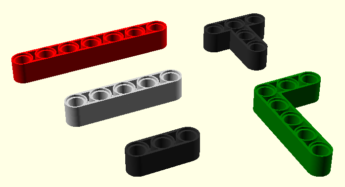
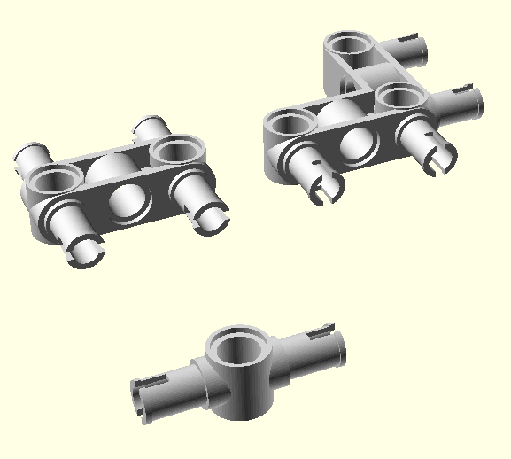

# open-bricks-technic

An OpenSCAD library for creating brick models.

## Usage


## Available parts

### Axles

```
obtAxStd(11, "lightgrey");
obtAxStd(9, "#303030");
obtAxStd(7, "lightgrey");
obtAxStd(5, "#303030");
obtAxStd(3, "lightgrey");
obtAxStd(2, "#303030");
```


### Bars

```
obtBarStd(7, "red");
obtBarStd(5, "lightgrey");
obtBarStd(3, "#303030");
obtBarTee3x3("#303030");
obtBarEll5x3("green");
```



### Pins

```
obtPinConnector();
obtPinDoubleConnector();

```


### Connectors

```
obtCon4PinStd();
obtCon4PinAngled();
obtCon2PinSglHole();
```



## Link collection

- [A list to a lot of real parts](https://www.brick-shop.de/index.php?cat=c670_LEGO-Technic-Technic-Steine-Liftarme-Kran-Dachsteine-Schraegsteine-Ersatzsteine-Einzelsteine-Lego-Brick-Shop-Lego-Shop-Pickabrick-selten-rar-box-Pick-A-Brick.html), buyable in a German brick shop


