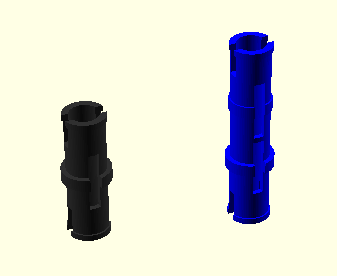

# open-bricks-technic

An OpenSCAD library for creating brick models.

## Usage

Just clone or copy the open-bricks-technic library to your desired folder and include the files by using `include <./open-bricks-technic/parts/ObtParts.scad>`

In case of the files cloned to `./lib/` a file demo.scad would e.g. look like

```
include <./libs/open-bricks-technic/parts/ObtParts.scad>

obtBarStd(5, "red");
```

and results in


## Available parts

### Axles

```
obtAxlStd(11, "lightgrey");
obtAxlStd(9, "#303030");
obtAxlStd(7, "lightgrey");
obtAxlStd(5, "#303030");
obtAxlStd(3, "lightgrey");
obtAxlStd(2, "#303030");
```


### Bars

```
obtBarStd(7, "red");
obtBarStd(5, "lightgrey");
obtBarStd(3, "#303030");
obtBarTee3x3("#303030");
obtBarEll5x3("green");
```


### Pins

```
obtPinConnector();
obtPinDoubleConnector();

```



### Connectors

```
obtCon4PinStd();
obtCon4PinAngled();
obtCon2PinSglHole();
```


## Link collection

- A list to a lot of real parts, buyable in a German [brick shop](https://www.brick-shop.de/index.php?cat=c670_LEGO-Technic-Technic-Steine-Liftarme-Kran-Dachsteine-Schraegsteine-Ersatzsteine-Einzelsteine-Lego-Brick-Shop-Lego-Shop-Pickabrick-selten-rar-box-Pick-A-Brick.html)


