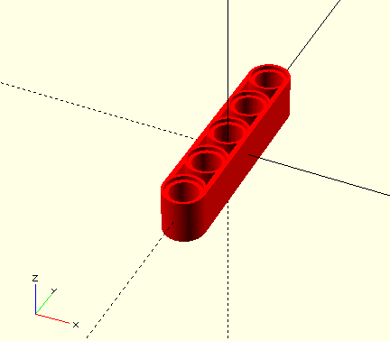

# Usage

To get access to the library's parts, clone or copy the open-bricks-technic library to your desired folder and include the files by using `include <./path/to/open-bricks-technic/parts/ObtParts.scad>` to your [OpenSCAD](https://www.openscad.org/) project. This allows you easily to use each part.

## Example
In case of cloning the files to `./lib/` a file  could e.g. look like

```
    include <./libs/open-bricks-technic/parts/ObtParts.scad>

    obtLftStd(5, "red");
```

and its output will result in




## Codestyle

All objects are named in lower camel case style. Constants are in capital letters with underscore inbetween the words.


## Abbreviations

To ideally achieve unique names for objects all available parts start with `obt` (**O**pen **B**ricks **T**echnik), followed by a three-character abbreviation for the appropriate category. The categories are:

- `Axl`: Axles
- `Brk`: Bricks (no parts available yet)
- `Con`: Connectors
- `Ev3`: EV3 (no parts available yet)
- `Grs`: Gears (no parts available yet)
- `Lft`: Liftarms
- `Lnk`: Links (no parts available yet)
- `Pnl`: Panels (no parts available yet)
- `Pin`: Pins
- `Pnm`: Pneumatics (no parts available yet)
- `Stg`: Steering (no parts available yet)
- `Whl`: Wheels (no parts available yet)

